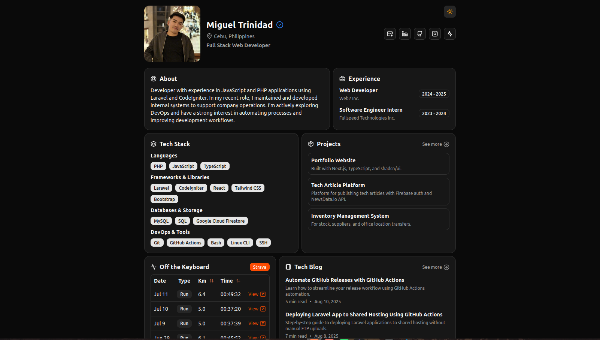

## Overview

This is my personal portfolio website built with Next.js, TypeScript, Tailwind CSS, and Shadcn UI. It is statically exported and deployed on an Amazon EC2 instance. The site integrates with the GitHub REST API to fetch and list repositories in the projects section, and the Strava API to show my last 30 activities.

## Technologies

- **Next.js**  
- **TypeScript**  
- **Tailwind CSS**  
- **Shadcn UI**  
- **GitHub REST API** – pulls project data  
- **Strava API** – shows recent activities  
- **Amazon EC2** – server for hosting  
- **Amazon S3** – stores build files  
- **AWS Systems Manager (SSM)** – triggers EC2 to sync from S3  
- **GitHub Actions** – handles build and deployment

## Deployment Flow

1. On every push to the `main` branch (or manual trigger), GitHub Actions:
   - Builds the Next.js project with static export (`npm run build`).
   - Uploads the `out/` directory to an S3 bucket.
   - Uses **SSM** to trigger a script (`/home/ubuntu/scripts/s3-sync.sh`) on the EC2 instance that pulls the latest build from S3.

2. The EC2 instance syncs from S3 to `/var/www/html`, serving the updated site.

3. A scheduled job also runs daily at **8:00 AM Philippines time (0:00 UTC)** to refresh the deployment.

## Security Notes

- **No more SSH from GitHub Actions**:  
  Port 22 is restricted to my own IP. GitHub Actions never connects via SSH.

- **Deployment is done via S3 + SSM**:  
  GitHub Actions uploads build artifacts to S3, then securely triggers EC2 to pull from S3 using AWS Systems Manager (SSM).

- **IAM Roles and Secrets**:  
  GitHub Actions uses least-privilege AWS credentials (only S3 + SSM permissions).  
  Sensitive environment variables (e.g., Strava API and GitHub tokens) are stored in **GitHub Repository Secrets**.

## Workflow File

See `.github/workflows/deploy.yml` for the full configuration:

## Live Site

Visit [migueltrinidad.com](https://migueltrinidad.com/) to see the live website.
