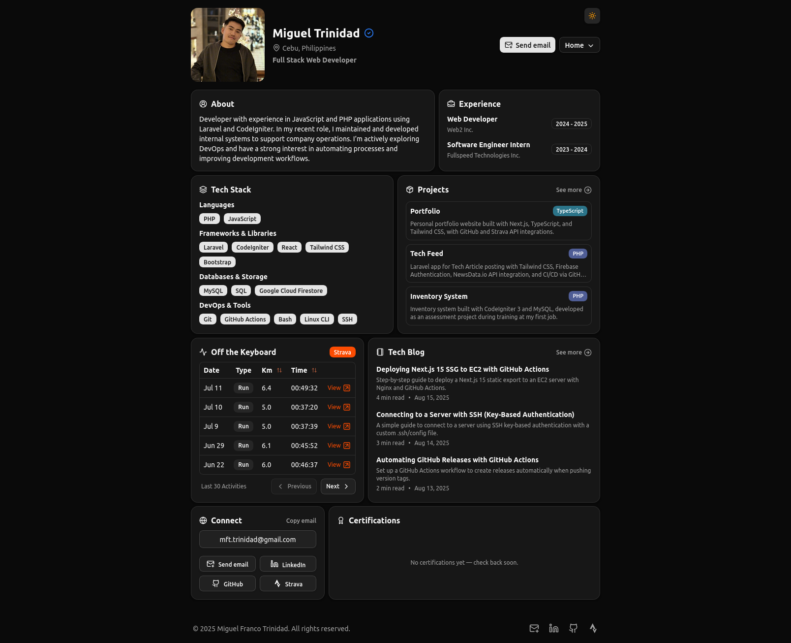

## Overview

My personal portfolio website built with Next.js, TypeScript, Tailwind CSS, and Shadcn UI. It integrates with the GitHub REST API to fetch and list repositories in the projects section, and the Strava API to show my last 30 activities.

Currently deployed on **Vercel** with automatic deployments on every push to `main`.

## Technologies

- **Next.js**
- **TypeScript**
- **Tailwind CSS**
- **Shadcn UI** - Component library
- **GitHub REST API** - pulls project/repository data
- **Strava API** - pulls recent activities

## Infrastructure & Deployment (Current)

- **Vercel** - hosting and deployment platform with automatic builds on push to `main`
- **Cloudflare** - CDN, DDoS protection, and additional security layer
- **Namecheap** - domain registrar
- **Security headers** - configured via `vercel.json` (HSTS, X-Frame-Options, etc.)
- **Environment variables** - managed through Vercel dashboard

## Deployment Flow (Current)

1. Push to `main` branch triggers Vercel to build and deploy automatically
2. A [Cloudflare Worker](https://migueltrinidad.com/projects/strava-webhook/) listens for Strava webhook events and triggers a Vercel redeploy whenever a new activity is added, keeping the site up to date
3. Vercel handles the build (`next build`), hosting, and SSL
4. Cloudflare sits in front for CDN and protection

## Previous Infrastructure (AWS)

Previously, this site was self-hosted on AWS with a more hands-on setup:

- **Amazon EC2** - hosting server running nginx to serve static files
- **nginx** - web server configured to serve from `/var/www/html` with HTTPS redirects
- **Let's Encrypt** - free SSL/TLS certificates via Certbot with automatic renewal
- **Amazon S3** - stored build artifacts uploaded by CI/CD
- **AWS Systems Manager (SSM)** - triggered EC2 to sync builds from S3
- **GitHub Actions** - CI/CD pipeline that built the project, uploaded to S3, and triggered SSM

### Previous Deployment Flow

1. On push to `main`, GitHub Actions would:
   - Build the Next.js project with static export (`npm run build`)
   - Upload the `out/` directory to an S3 bucket
   - Use SSM to trigger a script on EC2 that pulled the latest build from S3
2. EC2 synced from S3 to `/var/www/html`, where nginx served the updated site
3. A scheduled job ran daily at 8:00 AM Philippines time (0:00 UTC) to refresh the deployment

### Previous Security Setup

- No SSH access from GitHub Actions — port 22 restricted to my PC's IP only
- Secure deployment via S3 + SSM instead of direct SSH
- IAM least privilege — GitHub Actions used minimal AWS credentials (S3 + SSM only)
- nginx configured with caching, security headers, and HTTP to HTTPS redirects

## Live Site

Visit [migueltrinidad.com](https://migueltrinidad.com/) to see the live website.
